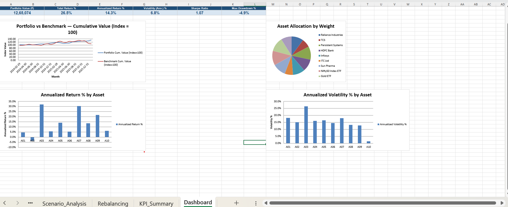

# 📊 Stock Market Portfolio Risk & Return Analyzer

An Excel-based portfolio analytics tool that models a ₹10,00,000 investment across 10 assets, calculates risk-adjusted performance, and benchmarks it against the NIFTY 50 — built entirely with live formulas, not hardcoded values.

> **Note:** This project uses simulated price data for educational/portfolio-showcase purposes. It is not investment advice and does not use live market data.

---

## 📈 Key Results

| Metric | Value |
|---|---|
| Total Investment | ₹10,00,000 |
| Current Portfolio Value | ₹12,65,074 |
| Total Return | 26.5% |
| Annualized Return | **14.3%** |
| Annualized Volatility | 6.8% |
| Sharpe Ratio | **1.07** |
| Maximum Drawdown | -4.9% |
| Benchmark | NIFTY 50 |

The portfolio outperformed its target return (13%) while keeping volatility low through diversification across large-cap equity, mid-cap, banking, technology, pharma, gold, and debt.

---

## 🖼️ Dashboard Preview

*KPI cards, portfolio vs. benchmark growth, asset allocation, and per-asset return/volatility — all on one screen.*

---

## 🧮 What This Project Covers

- **Investor profiling** — objective, risk appetite, horizon, and target return defined up front
- **Returns calculation** — monthly returns per asset, weighted portfolio return, benchmark return
- **Risk metrics** — volatility (annualized), Beta, Sharpe Ratio, Treynor Ratio, Value at Risk (95%), Maximum Drawdown (true peak-to-trough, via wealth-index method)
- **Diversification analysis** — full 10×10 correlation matrix with a heatmap
- **Benchmarking** — portfolio vs. NIFTY 50 cumulative growth, excess return
- **Scenario / what-if analysis** — 5 hypothetical shocks (market rally/correction, sector-specific declines, flight-to-gold) with estimated ₹ impact
- **Rebalancing** — current vs. target allocation with Buy/Sell/Hold recommendations
- **Interactive dashboard** — KPI cards + 4 charts, all formula-driven and auto-updating

---

## 🗂️ Workbook Structure

| Sheet | Purpose |
|---|---|
| `Investor_Profile` | Investor details, objectives, risk parameters |
| `Raw_Prices` | 24 months of price data, 10 assets + benchmark |
| `Portfolio_Holdings` | Weights, quantities, current value per asset |
| `Returns` | Monthly returns per asset + weighted portfolio return |
| `Risk_Analysis` | Volatility, Beta, Sharpe, Treynor, VaR, Max Drawdown |
| `Correlation` | 10×10 correlation matrix with heatmap |
| `Benchmark` | Portfolio vs. NIFTY 50 comparison |
| `Scenario_Analysis` | 5 what-if market scenarios |
| `Rebalancing` | Target vs. current weight, buy/sell recommendations |
| `KPI_Summary` | Single-view summary of all headline metrics |
| `Dashboard` | Visual summary — KPI cards + 4 charts |

---

## 🛠️ Tools Used

- Microsoft Excel (formulas: `STDEV.P`, `SLOPE`, `CORREL`, conditional formatting, charts)
- No macros/VBA — every calculation is a native Excel formula, fully auditable

---

## 🚀 How to Use

1. Download `Portfolio_Risk_Return_Analyzer.xlsx`
2. Open in Excel (or a compatible spreadsheet app) and enable editing
3. Edit the **yellow cells** in `Portfolio_Holdings` (target weights) or `Rebalancing` (target allocation) to model your own portfolio
4. All downstream sheets (Returns, Risk_Analysis, Dashboard) recalculate automatically

---

## 💡 What I Learned

Building this project reinforced how risk and return interact in a diversified portfolio — a 1.07 Sharpe Ratio shows the portfolio is being adequately compensated for the risk it carries, while the low 6.8% volatility (versus 12–26% for individual holdings) demonstrates the real, measurable effect of diversification across uncorrelated asset classes like equity, gold, and debt.

---

## 📬 Contact

*Add your name, LinkedIn, and email here.*
